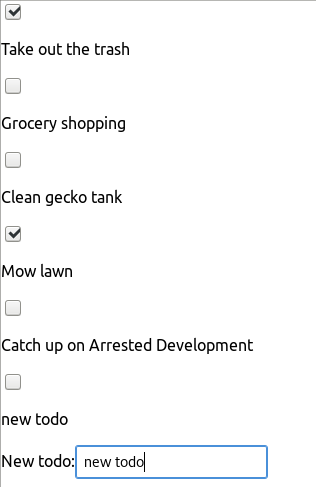

# Simple Todo App in ReactJS

My first ReactJS app. Started by following this [awesome tutorial](https://www.youtube.com/watch?v=DLX62G4lc44&list=WL&index=4&t=0s).

## Functionality

Very basic app. As in the the tutorial it allows for a set of todo's and to delete them.
I added the functionality to add new todos and to save the state locally.
Then updated
## Improvements I Wanna Add:
* [ ] Add Style (currently just the simple stuff)
* [ ] Add API to collect and save todo's on some cloud storage
* [X] Convert this to React Native to use on Android -> Doing this in [this rep](https://github.com/ISTeo/simpleTodoReactNative).

## Currently working
Make this app up to that to the [react native version](https://github.com/ISTeo/simpleTodoReactNative) at this time. Basically add the completed state, am individual button to delete each todo when completed and a button to delete all completed.
