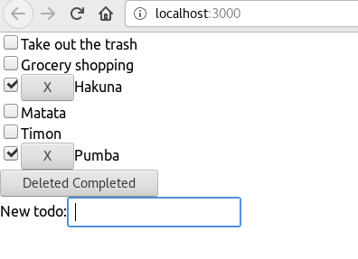

# Simple Todo App in ReactJS

My first ReactJS app. Started by following this [awesome tutorial](https://www.youtube.com/watch?v=DLX62G4lc44&list=WL&index=4&t=0s).

## Functionality

Very basic app. As in the the tutorial it allows for a set of todo's and to delete them.
I added the functionality to add new todos and to save the state locally.

## Improvements I Wanna Add:
* [ ] Add Style (currently just the simple stuff)
* [ ] Add API to collect and save todo's on some cloud storage
* [ ] Convert this to React Native to use on Android
